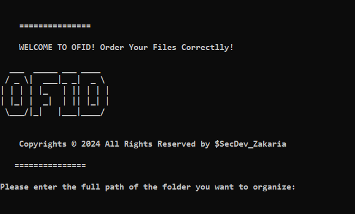
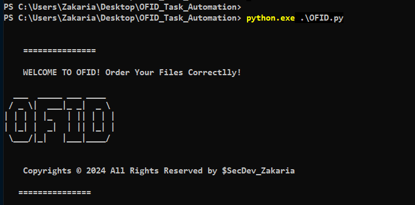
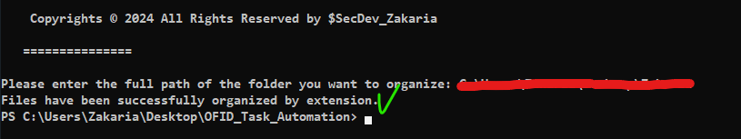

# OFID Task Automation

⚙ **OFID (Order Files into Directories)** is a script tool designed to organize disorganized files in a folder based on their file extension.

💡 Considering the existence of various and different file extensions, this script will be able to analyze the type of each file (for example, **.pdf, .docx, .png,** etc.) and classify them accordingly. This approach helps maintain a logical and structured order of files within a folder that could otherwise become disorganized, thus facilitating their management and access.

❓ **How it works ?**

1. Download the script 

2. Choose the directory where you will place it.

3. Open **PowerShell**.

4. Change Directorie to the folder where the script exist : ***cd*** *C:\<folder-path>*.

5. Execute the script : ***python.exe*** or ***py.exe*** followed by *.\OFID.py*.

6. Finally! Paste the folder's path you want to order it files.

✅ Done! Your files have been successfully organized by their extensions.

**BEFORE ::**

**AFTER ::**

Follow me on : 

**Github** : https://github.com/BARI-Zakaria

**LinkedIn** : https://www.linkedin.com/in/zakaria-bari/

**Medium** : https://medium.com/@SecDev_Zakaria
